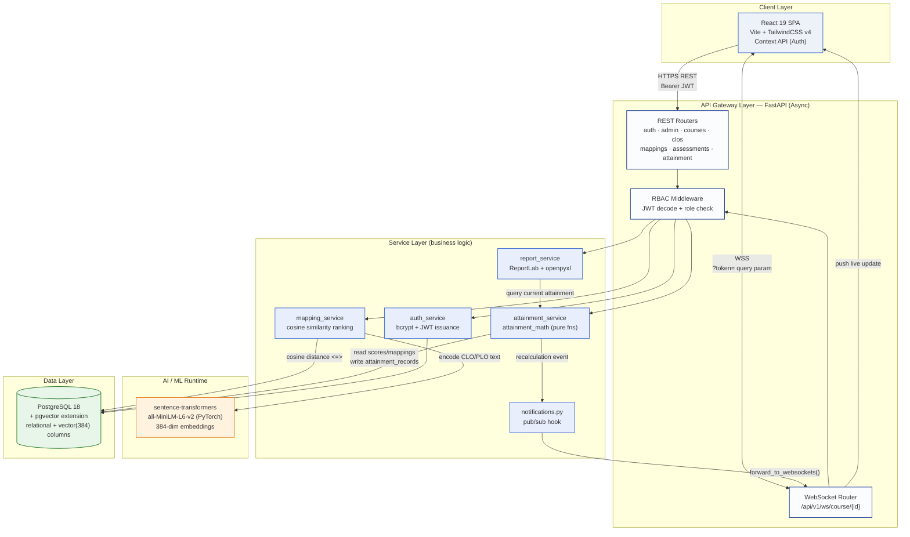
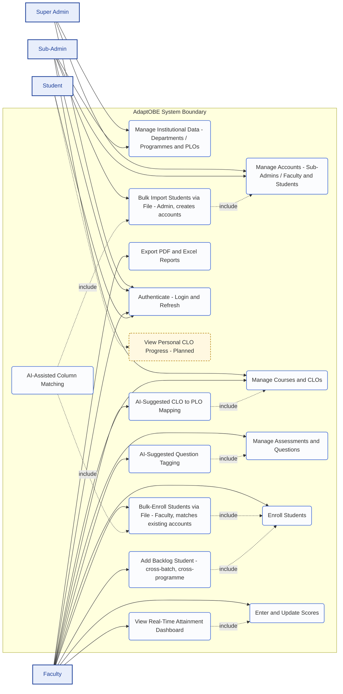
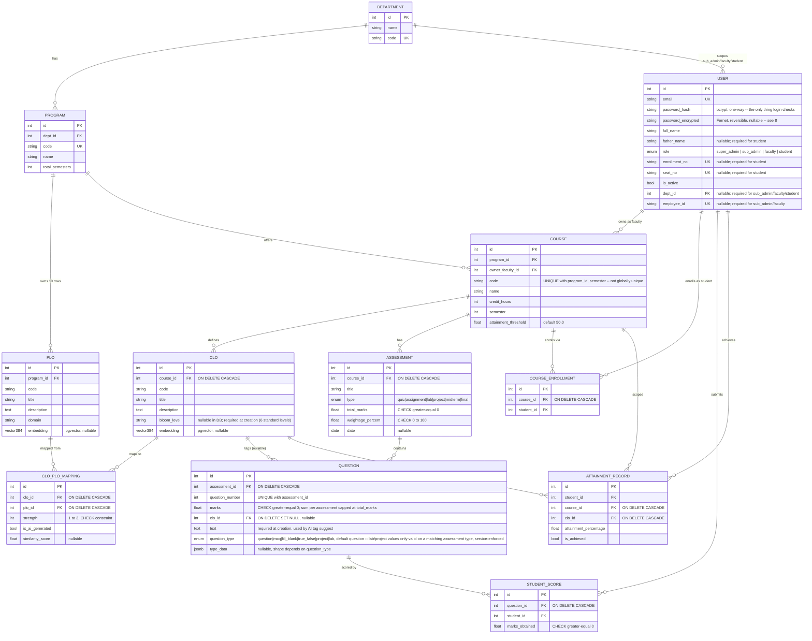
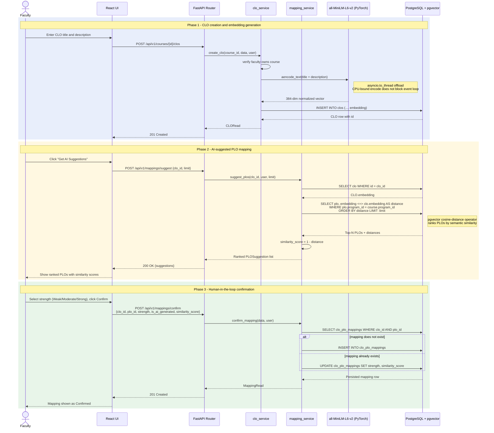

# AdaptOBE — Software Design Document (SDD) & SDLC Documentation

**Project:** AdaptOBE — Intelligent Outcome-Based Education Attainment & Adaptive Learning Platform
**Institution:** Department of Computer Science, UBIT (Umaer Basha Institute of Information Technology)
**Document type:** Final Year Project — Software Design Document
**Status:** Modules 0–4 implemented, tested, and demo-verified; Modules 5–7 planned (see §10). Additional work completed after the original module numbering — the Super Admin / Sub-Admin role split, AI-assisted bulk student import, and a full faculty-modules overhaul (course/CLO/question validation, enrollment file import and backlog-student enrollment, batch-year-aware seat number eligibility, structured question types, account reactivation/search, a full mobile/responsive frontend pass) — is documented throughout this revision; see [`CHANGELOG.md`](../CHANGELOG.md) for the dated history.

---

## Table of Contents

1. [Introduction](#1-introduction)
2. [SDLC Methodology & System Overview](#2-sdlc-methodology--system-overview)
3. [System Architecture — Diagram 1](#3-system-architecture--diagram-1)
4. [Requirements & Use Cases — Diagram 2](#4-requirements--use-cases--diagram-2)
5. [Data Design — Diagram 3](#5-data-design--diagram-3)
6. [AI Subsystem Design — Diagram 4](#6-ai-subsystem-design--diagram-4)
7. [Core Workflow Design — Diagram 5](#7-core-workflow-design--diagram-5)
8. [Non-Functional Requirements & Security](#8-non-functional-requirements--security)
9. [Testing Strategy](#9-testing-strategy)
10. [Implementation Status & Roadmap](#10-implementation-status--roadmap)
11. [Appendix — Technology Stack](#11-appendix--technology-stack)

---

## 1. Introduction

### 1.1 Purpose
This document describes the software design of AdaptOBE: its architecture, data model, AI subsystems, and core workflows. It is written from the actual, working implementation — every diagram and claim in this document is verified against the real codebase and, where noted, against live-tested runtime behavior, not a proposed or aspirational design.

### 1.2 Scope
AdaptOBE automates three things that are normally done by hand in Outcome-Based Education programmes:
1. **CLO → PLO mapping**, using NLP sentence embeddings instead of manual, subjective judgment.
2. **Direct attainment calculation**, from raw assessment scores to CLO/PLO attainment percentages, with every required edge case handled explicitly.
3. **Real-time visibility and reporting**, so faculty see attainment update live and can export accreditation-ready reports on demand.

### 1.3 Definitions & Acronyms

| Term | Meaning |
|---|---|
| OBE | Outcome-Based Education |
| CLO | Course Learning Outcome |
| PLO | Programme Learning Outcome |
| RBAC | Role-Based Access Control |
| JWT | JSON Web Token |
| ORM | Object-Relational Mapping |
| pgvector | PostgreSQL extension for native vector storage and similarity search |
| Cosine similarity | A measure of how close two embedding vectors point in the same direction — used to rank semantic closeness |

---

## 2. SDLC Methodology & System Overview

### 2.1 SDLC Model

AdaptOBE was built using an **Agile, module-based incremental delivery model**, not a single big-bang implementation. The system specification itself is organized as a sequential roadmap of modules, and each module was executed as one iteration with a strict **definition of done**:

1. Implement the module's models, services, and API endpoints.
2. Write automated tests **alongside** the implementation — not retrofitted afterward — including every documented edge case.
3. Run the full test suite and confirm all tests pass before moving to the next module.
4. Commit with a module-referencing message, so the project history is itself a record of the iterations.

This produced eight completed iterations to date:

| Module | Delivered |
|---|---|
| 0 | Local PostgreSQL 18 + pgvector, FastAPI/SQLAlchemy async skeleton |
| 1 | JWT auth, bcrypt hashing, RBAC middleware, Admin CRUD (users/departments/programmes) |
| 2 | Course/CLO/PLO management, AI semantic mapping engine |
| 3 | Assessments, scoring, the direct attainment engine |
| 4 | Faculty dashboard, real-time WebSockets, PDF/Excel export |
| — | Institutional data seed (UBIT department, 4 programmes, 10 PLOs) |
| — | Frontend UI expansion (Admin panel, course authoring, mapping UI, scoring UI) |

Each iteration ended with a working, tested increment — the system has been demoable after every module, which is the core Agile property this methodology was chosen for.

The same discipline continued after Module 4 for work that didn't map onto the original module numbering: splitting the flat Admin role into Super Admin / Sub-Admin, adding AI-assisted bulk student import, and — most recently — a full pass over every faculty-facing module (Courses, CLOs/Mappings, Enrollments, Assessments, Questions) fixing gaps found during real usage: duplicate-prevention rules, missing Edit/Delete affordances, non-technical-friendly AI suggestion labels, a distinct "backlog student" enrollment path with dynamic (never-stale) batch-year eligibility, and structured question types (later refined so Lab and Project are their own assessment types rather than two more question-type choices). Most recently, a full pass made the frontend responsive down to mobile. All of it was built with the same test-alongside-implementation, full-suite-before-commit process — see [`CHANGELOG.md`](../CHANGELOG.md) for the dated entries.

### 2.2 Core System Objectives

- Replace manual, spreadsheet-driven CLO-to-PLO mapping with an AI-assisted, **human-in-the-loop** suggestion engine.
- Compute direct attainment correctly under every edge case an academic auditor would ask about (absent students, zero-denominator CLOs, threshold flagging).
- Give faculty **real-time** visibility into attainment without manual refresh.
- Enforce strict Role-Based Access Control so Super Admin, Sub-Admin (department-scoped), Faculty, and Student capabilities never overlap.
- Produce accreditation-ready PDF/Excel reports on demand.

### 2.3 Development Practices

- **Async-first backend**: every database interaction uses SQLAlchemy 2.0 `AsyncSession`; no blocking I/O in request handlers.
- **Layered separation**: routers contain no business logic — they call into a dedicated services layer, which is what makes the attainment math and AI matching independently unit-testable.
- **Schema-as-code**: every schema change is a reviewed Alembic migration, checked for drift (`alembic check`) before being considered complete.
- **Test-first edge cases**: the mathematical edge cases in §7 were written as pytest cases *while* the attainment engine was being built, per the project's own governing specification.

---

## 3. System Architecture — Diagram 1

### Design Decisions

- **Routers → Services → Data, strictly layered.** Routers only translate HTTP ↔ Pydantic schemas and catch typed service exceptions (`NotFoundError`, `ConflictError`, `PermissionDeniedError`) into HTTP status codes. All business logic — including the attainment math and the AI matching — lives in the service layer, which is what allows it to be unit-tested with zero HTTP or database mocking (see §9).
- **pgvector co-located with relational data**, not a separate vector database. CLO/PLO embeddings live as native `vector(384)` columns in the same PostgreSQL instance as the relational schema. This avoids a second system to keep in sync and lets a single SQL query join relational filters (e.g. "same programme") with a vector similarity ORDER BY in one round trip.
- **Native FastAPI WebSockets, not a message broker.** Because this is a single-process deployment, an in-memory `ConnectionManager` keyed by `course_id` is sufficient and avoids the operational overhead of Redis pub/sub. The `notifications.py` module is deliberately decoupled from the WebSocket transport (a simple subscribe/broadcast interface) so the attainment engine has no knowledge that WebSockets exist — swapping in Redis later would only mean changing what subscribes to it.
- **JWT access + refresh tokens**, validated per-request with no server-side session store, keeping the API layer stateless and horizontally scalable in principle.
- **WebSocket authentication via query parameter.** Browsers cannot set custom headers on the WebSocket handshake, so the access token travels as `?token=`, validated against the same RBAC and course-ownership rules as the REST endpoints before the connection is accepted.

---

## 4. Requirements & Use Cases — Diagram 2

### Design Decisions

- **Four actors map exactly onto the `user_role` enum** (`super_admin`, `sub_admin`, `faculty`, `student`) enforced by RBAC middleware — there is no use case in this diagram that isn't backed by a `require_roles(...)` dependency on its endpoint.
- **`UC12` is explicitly marked planned, not implemented.** Student accounts exist today (they can authenticate and be enrolled/scored by faculty), but there is no student-facing portal yet — that is Module 6 on the roadmap. Marking this honestly on the use case diagram, rather than omitting it or presenting it as done, keeps the document accurate for evaluation.
- **`include` relationships** show real functional dependencies, not decoration: AI-suggested mapping only exists inside CLO management; AI-suggested question tagging only exists inside assessment management; the live dashboard's headline metric is the class-average attainment produced by score entry.
- **Admin capabilities are split by scope, not just by tier.** Super Admin manages only departments and sub-admin accounts (institution-wide, but nothing department-operational). Sub-Admin is scoped to exactly one department (`users.dept_id`) and manages that department's programmes, PLOs, faculty/student accounts, and courses — a sub-admin cannot read or write another department's rows even by editing an ID, enforced in the service layer, not just the router guard. Assessments, enrollments, CLO-PLO mapping confirmation, and attainment reporting remain faculty-only teaching-workflow resources that neither admin tier touches.
- **`UC13`/`UC14` model bulk import as a second, independent application of the AI capability already built for `UC4`/`UC6`.** Uploading a roster (`UC13`) always includes column matching (`UC14`) — you cannot import without it — and `UC13` itself is `include`d by `UC2` (Manage Accounts) because a bulk import is, semantically, still account creation; it just arrives as a batch instead of one form submission at a time. Deliberately reuses `all-MiniLM-L6-v2` (the same model as `UC4`) rather than introducing a second AI dependency — see §6's design decisions for why.
- **`UC13` (admin, creates accounts) and `UC15` (faculty, matches existing accounts) are deliberately separate use cases, not one generalized "bulk upload" use case**, despite both parsing an Excel/PDF roster and reusing the same AI column matcher (`UC14`). `UC13` is account provisioning — sub-admin-only, per the admin-hierarchy split above. `UC15` is roster management for one course — faculty-only, and it never creates an account; a row that doesn't match an existing student is reported, not silently provisioned. Collapsing them into one use case would blur an authorization boundary that's real in the code (`student_import_service.py` vs `enrollment_import_service.py`, two separate services).
- **`UC16` (Add Backlog Student) is `include`d by `UC7` (Enroll Students) but is functionally its own eligibility rule, not a variant of `UC15`.** Normal enrollment (manual, or via `UC15`) restricts candidates to the course's own programme *and* the batch year its semester implies right now (see §5's seat-number design decision). `UC16` inverts that: any programme in the department, but strictly an *earlier* batch — for a student repeating the course. Both rules live in one function (`user_service.list_active_students`), selected by a `backlog` flag, rather than being two independent implementations that could drift apart.

---

## 5. Data Design — Diagram 3

### Design Decisions

- **PLOs are stored per-programme, not in a shared table.** `plos.program_id` is a foreign key, so with 4 fixed programmes and 10 standard outcomes there are 40 PLO rows, not 10. This is deliberate: it keeps the CLO→PLO suggestion query scoped to a single programme with a plain `WHERE program_id = :id`, and lets one programme revise its wording later without disturbing the other three. A shared-outcomes-with-a-join-table design was considered and rejected as unnecessary complexity at this scale.
- **Cascade rules were fixed after a real bug.** Early on, `clos.course_id` and the mapping foreign keys had no `ON DELETE` behavior, so deleting a course that had CLOs raised an unhandled `ForeignKeyViolationError` (a 500 response). Courses now cascade-delete their CLOs and mappings. Deleting a CLO, however, uses `ON DELETE SET NULL` on `questions.clo_id` — a question is exam-record data that must survive its CLO tag being removed; only the tag is cleared, not the question.
- **`attainment_records` is derived, not authoritative, data.** It is fully recomputed (delete-then-reinsert) on every score change rather than patched incrementally — see §7 for why this trades a small amount of write volume for correctness guarantees that are much easier to reason about and test.
- **Every table that needs one has a `UNIQUE` constraint doing real work**: `(clo_id, plo_id)` prevents duplicate mappings (confirming twice updates instead of inserting), `(course_id, student_id)` prevents double enrollment, `(question_id, student_id)` prevents duplicate score rows, and `(student_id, course_id, clo_id)` keeps exactly one attainment record per student per CLO per course.
- **`vector(384)` matches the embedding model exactly** (`all-MiniLM-L6-v2` — see §6) and is nullable because a CLO/PLO can theoretically exist before its embedding is generated (e.g. if the AI service were temporarily unavailable), rather than blocking the write.
- **`users` deliberately stores a password two ways.** `password_hash` is a one-way bcrypt hash and is the *only* column `authenticate_user` ever reads. `password_encrypted` is a second, reversibly-encrypted copy (Fernet, symmetric key in `PASSWORD_ENCRYPTION_KEY`) added so an authorized admin can view a generated password again from the Edit page — an explicit product requirement, not an oversight. This is a genuine, acknowledged reduction in security posture versus hash-only storage: anyone with database or key access can recover every plaintext password. It is nullable because accounts created before this feature, or whose password was set outside application code, have no encrypted copy — the UI shows "Not available" for those rather than erroring. See §8 for the full trade-off statement. The manual "Add Student" form no longer collects a password at all — `UserCreate.password` is optional, and `auth_service.register_user` calls the same `generate_password()` bulk import already used (8 characters, guaranteed letter + digit, no ambiguous `0/O/1/l/I` glyphs) whenever it's omitted, then the frontend immediately reveals it via the existing password-reveal endpoint.
- **`courses.code` moved from a global `UNIQUE` to `UNIQUE(program_id, code, semester)`.** The global constraint was actually *stricter* than intended: it blocked reusing a course code across programmes or across semesters (e.g. a retake offering), which is a legitimate real-world case. The composite constraint still catches an actual duplicate (same programme, code, and semester) with a 409, both on create and on a partial `PATCH` that only touches one of the three fields — the service re-derives the full resulting combination before checking, not just the changed field.
- **Lab and Project are assessment-level types, and `question_type` is validated against the parent assessment's type — not left as a free choice.** `AssessmentType` carries `lab` and `project` alongside quiz/assignment/midterm/final; a Lab assessment's `Question` rows must all be `question_type: lab`, a Project assessment's must all be `question_type: project`, and every other assessment type is refused both, enforced in `question_service.py` on create, bulk-create, and update. This replaced an earlier design where Lab/Project were just two more options in the generic question-type picker, which faculty found confusing (a "Lab" question sitting inside a "Quiz" assessment). The frontend reflects this with a dedicated `LabProjectPanel.jsx` instead of the generic question-type picker for those two assessment types — but the underlying `Question`/`type_data` rows are unchanged, so Score Entry required no changes at all.
- **Course-enrollment eligibility (`courses.semester` + `users.seat_no`) is computed dynamically, not stored anywhere.** A student's seat number encodes their enrollment year (`B<2-digit year><programme code><roll>`, e.g. `B241101-0007`). `app.core.institution.expected_seat_no_year(semester)` derives the year a *current-batch* student in that semester should have enrolled, relative to *today's real calendar year* — two semesters per academic year, so semester 4 right now implies 2024, semester 8 implies 2022. This intentionally never freezes at course-creation time (no `courses.created_at` column exists, or was added for this): the same course's eligible batch quietly advances every year without a migration. The inverse rule, `is_backlog_batch_year`, powers "Add Backlog Student" — any programme, but strictly an *earlier* batch than the current one, for a student repeating the course. Both rules are pure functions (`app/core/institution.py`), unit-tested directly against the two motivating examples (semester 4 → 2 years back, semester 8 → 4 years back) rather than only through an HTTP round-trip.

---

## 6. AI Subsystem Design — Diagram 4

### Design Decisions

- **Model choice: `all-MiniLM-L6-v2`.** Selected over larger sentence-transformer models as the right accuracy/latency trade-off for this use case: it produces reasonably strong semantic embeddings for short academic-outcome text at a fraction of the inference cost of a larger model, which matters because embedding happens synchronously inside a user-facing request (CLO/PLO creation).
- **Embeddings are computed once, at creation time**, not on every mapping request. `clos.embedding` and `plos.embedding` are persisted columns; suggesting matches for a CLO is a single indexed similarity query, not a re-encode of every PLO on every request.
- **The CPU-bound encode is offloaded via `asyncio.to_thread`.** Sentence-transformer inference is synchronous and CPU-bound; running it directly inside an `async def` route would block the entire event loop for every other concurrent request. Offloading to a worker thread keeps the async architecture's core guarantee intact.
- **pgvector's `<=>` cosine-distance operator**, not `<->` (L2/Euclidean distance). Embeddings are L2-normalized at encode time, so `similarity_score = 1 - cosine_distance` is a mathematically clean, directly interpretable 0–1 score.
- **Human-in-the-loop by design, not full automation.** The AI never writes a `clo_plo_mappings` row on its own — `/mappings/suggest` is read-only and returns ranked candidates; only `/mappings/confirm`, triggered by an explicit faculty action, persists a mapping. This was a deliberate trust boundary: semantic similarity is a strong *suggestion* signal, not a substitute for an academic's judgment on mapping strength.
- **Live-verified result**: for a CLO worded around agile teamwork, the engine correctly ranked the PLO "Individual and Team Work" first with 0.56 cosine similarity ahead of four other candidates — confirmed against the real seeded UBIT PLO set, not synthetic test data.
- **The raw cosine score is computed exactly as above but is no longer the primary thing faculty see.** Both suggestion UIs (CLO→PLO mapping and question→CLO tagging) now show a plain-language label — Strong (≥0.5), Moderate (≥0.3), or Weak (below 0.3) — with an "ⓘ" info affordance revealing the underlying score and a one-sentence explanation of the method for a non-technical reader. This is a presentation-layer change only (`frontend/src/utils/similarity.js`); the API still returns the full-precision `similarity_score`, and the thresholds match the mapping-strength auto-suggestion that already existed, so the qualitative label and the suggested strength (Weak/Moderate/Strong, 1–3) never disagree with each other.
- **The same model has a second, unrelated application: matching an uploaded roster's column headers to student fields** (`app/ml/column_matcher.py`, used by `UC13`/`UC14` in §4). Rather than introducing a second AI dependency for bulk student import, an uploaded file's headers ("Guardian Name", "Roll No") are encoded with the identical `all-MiniLM-L6-v2` call and compared by cosine similarity against a short descriptive prompt per required field — an exact-alias lookup handles obvious headings first, and only unrecognized ones fall through to the embedding comparison. This is a pure-Python dot product, not a `pgvector` query, because there is nothing in the database to compare against: the vectors being compared are two pieces of text extracted from a file, not a stored embedding column. `encode_text` already L2-normalizes its output (see above), so cosine similarity is exactly the dot product — no numpy dependency was needed to add this. **Live-verified**: uploading a roster with headings "Student Name", "Guardian Name", "Enrollment No", "Roll No", "Email Address" correctly matched all five to `full_name`, `father_name`, `enrollment_no`, `seat_no`, `email` respectively, none of which are on the alias fast-path list.

---

## 7. Core Workflow Design — Diagram 5

```mermaid
flowchart TD
    Start(Start: Faculty submits score grid) --> Validate[Validate whole batch:<br/>question in assessment,<br/>marks_obtained less-equal question.marks,<br/>student is enrolled]

    Validate --> BatchOK{All rows valid?}
    BatchOK -- No --> Reject[Reject entire batch - HTTP 422<br/>nothing written to DB]
    Reject --> EndReject(End)

    BatchOK -- Yes --> Upsert[Upsert student_scores rows<br/>update if exists, else insert]
    Upsert --> Commit1[(Commit transaction)]
    Commit1 --> Trigger[Trigger recalculate_course_attainment]

    Trigger --> WipeOld[Delete existing attainment_records for course]
    WipeOld --> HasData{CLOs exist AND<br/>students enrolled?}
    HasData -- No --> Broadcast0[Broadcast event: student_count = 0]
    Broadcast0 --> EndEmpty(End)

    HasData -- Yes --> LoopCLO[For each CLO in course]
    LoopCLO --> SumPossible[possible = sum of marks<br/>for questions tagged to this CLO]
    SumPossible --> ZeroCheck{possible <= 0?}
    ZeroCheck -- Yes --> ZeroResult[attainment = 0.00%<br/>log warning, no exception]
    ZeroCheck -- No --> LoopStudent[For each enrolled student]

    LoopStudent --> HasScore{Score row exists<br/>for student and question?}
    HasScore -- No, absent --> DefaultZero[obtained = 0.0<br/>student still counted in cohort]
    HasScore -- Yes --> SumObtained[obtained = sum of marks_obtained]
    DefaultZero --> ComputePct[clo_attainment = obtained / possible times 100]
    SumObtained --> ComputePct

    ComputePct --> ClassAvg[class_average = mean of all students' clo_attainment<br/>absentees included in denominator]
    ZeroResult --> ClassAvg
    ClassAvg --> Threshold{class_average >=<br/>course.attainment_threshold?}
    Threshold -- Yes --> Achieved[is_achieved = true]
    Threshold -- No --> NotAchieved[is_achieved = false]

    Achieved --> WriteRecords[Insert attainment_records<br/>one row per student per CLO]
    NotAchieved --> WriteRecords
    WriteRecords --> MoreCLOs{More CLOs<br/>to process?}
    MoreCLOs -- Yes --> LoopCLO
    MoreCLOs -- No --> Commit2[(Commit transaction)]

    Commit2 --> Publish[notifications.broadcast<br/>type: attainment.recalculated, course_id]
    Publish --> WSForward[forward_to_websockets subscriber<br/>ConnectionManager.broadcast course_id]
    WSForward --> Push[Push JSON message to every<br/>WebSocket client watching this course]
    Push --> Client[Faculty Dashboard - useCourseWebSocket hook<br/>onmessage handler fires]
    Client --> Refetch[GET /api/v1/attainment/course/id]
    Refetch --> Rerender[Heatmap and stat tiles re-render<br/>no page reload]
    Rerender --> EndSuccess(End)

    classDef decision fill:#FFF8E1,stroke:#B8860B,stroke-width:1.5px
    classDef terminal fill:#E8EEFB,stroke:#1C3F99,stroke-width:2px
    classDef edge fill:#FDECEA,stroke:#C0392B,stroke-width:1.5px
    classDef normal fill:#FBFCFE,stroke:#476FD6,stroke-width:1.5px
    classDef db fill:#E8F5E9,stroke:#2E7D32,stroke-width:1.5px

    class Start,EndReject,EndEmpty,EndSuccess terminal
    class BatchOK,HasData,ZeroCheck,HasScore,Threshold,MoreCLOs decision
    class Reject,ZeroResult,DefaultZero edge
    class Commit1,Commit2 db
```

### Design Decisions

- **The attainment math is a pure function**, taking numbers in and returning a percentage out — no database session, no HTTP context. This is what makes it possible to unit-test every edge case in isolation (division-by-zero, empty cohort, zero mapping strength) in milliseconds, without spinning up a database transaction for each case.
- **"Validate the whole batch, then write" — not row-by-row.** Score entry validates every row in a submitted grid before writing any of them. A single invalid row (over-max marks, an unenrolled student) rejects the entire batch, so faculty never end up with a half-entered assessment silently missing some students' scores.
- **Recalculation replaces, it does not patch.** `attainment_records` for a course are deleted and rebuilt from scratch on every recalculation, rather than updating individual rows in place. This trades some write volume for a much stronger correctness guarantee: there is no code path where a stale record from a since-deleted question or since-unenrolled student can survive, because the whole set is regenerated from current source data every time.
- **Absent students are a first-class case, not an omission.** A student with no score row for a question is not excluded from the class average — they are scored 0.0 and still counted in the denominator. This was a specific edge case called out by the governing specification and is directly covered by tests (see §9).
- **The notification layer is decoupled from its transport.** `attainment_service` calls a generic `notifications.broadcast(event)` with no knowledge of WebSockets; a subscriber registered at application startup forwards matching events into the `ConnectionManager`. This means the real-time layer could be swapped (e.g. for a multi-process deployment behind Redis pub/sub) without touching the attainment engine at all.
- **Live-verified result**: entering a single new score during development moved a CLO's class average from 70.0% to 72.0% on an already-open dashboard in a separate browser tab, with zero manual refresh — confirming the full pipeline from score submission to WebSocket push actually works end to end, not just in isolation.

---

## 8. Non-Functional Requirements & Security

| Concern | Implementation |
|---|---|
| **Authentication** | JWT access tokens (15 min) + refresh tokens (7 days), issued via `python-jose`. Access tokens are silently refreshed by the frontend on a 401, coalesced so concurrent requests trigger one refresh, not many. |
| **Password storage** | bcrypt, salted per-user, for authentication — `authenticate_user` never reads anything else. |
| **Password recoverability (explicit trade-off)** | A *second* copy is stored reversibly-encrypted (Fernet, key in `PASSWORD_ENCRYPTION_KEY`) so an authorized admin can view a generated password again from the Edit page — a deliberate product requirement, not an oversight. **This is a genuine reduction in security posture** versus hash-only storage: database or key access recovers every plaintext password. It is returned only via one narrow, RBAC- and department-scoped endpoint (`GET /admin/users/{id}/password`) and is never included in any list/table response. |
| **Authorization (RBAC)** | Every protected endpoint declares its allowed roles explicitly via a `require_roles(...)` FastAPI dependency; there is no endpoint that relies on the frontend to hide a button as its only access control. |
| **WebSocket authorization** | Same RBAC and course-ownership checks as the REST API, applied at connection time via the `?token=` query parameter (browsers cannot set custom headers during the WS handshake). |
| **CORS** | Explicitly restricted to the known frontend origin in development; not left wildcard-open. |
| **Referential integrity** | Cascade rules chosen per-relationship on purpose (see §5) — cascade where child data is meaningless without its parent, `SET NULL` where the child record must outlive the parent reference. |
| **Input validation** | Every request body is a Pydantic v2 schema with field-level constraints (e.g. `strength` between 1 and 3, `weightage_percent` between 0 and 100) validated before it reaches business logic. |
| **Responsive design** | The React frontend scales from desktop down to a 375px phone using Tailwind's responsive breakpoints — a full pass added a mobile navigation menu, made every data-entry form and page header collapse to single-column/stacked layout below `sm`, and left wide data tables (including the CLO×PLO heatmap) on the existing horizontal-scroll pattern, the conventional approach for dense tabular data on small screens. |

---

## 9. Testing Strategy

AdaptOBE has **280 automated backend tests**, all passing, organized in three tiers (165 at the original Module 0–4 writing of this document; the rest cover the role split, cross-department isolation, bulk import, the faculty-modules round, and the Lab/Project assessment-type coupling added since — see `CHANGELOG.md`):

1. **Pure unit tests** on the attainment math (24 tests) and, since the faculty-modules round, the seat-number batch-year math (`test_seat_no.py`, 20 tests covering `expected_seat_no_year`/`expected_seat_no_prefix`/`is_backlog_batch_year` against the exact semester-4/semester-8 examples that motivated the feature) — no database, no HTTP, sub-second execution. Every edge case in §7 (zero-denominator, empty cohort, absentee handling, custom thresholds) has a dedicated test.
2. **Service/engine integration tests** — exercise the attainment engine, the AI mapping engine, and the WebSocket `ConnectionManager` against a real (but transactionally isolated and rolled back) PostgreSQL database, so nothing written during a test run persists.
3. **API/RBAC tests** — drive every endpoint through its full HTTP surface, asserting both the happy path and that each role boundary actually rejects the roles it should (e.g. a student attempting an admin-only action gets a 403, not a 200).

Real bugs were caught by this process rather than by manual testing, each fixed and covered by a regression test immediately: a missing `ON DELETE CASCADE` that caused a 500 when deleting a course with CLOs; two RBAC routers that were accidentally admin-only end-to-end when faculty needed read access to function at all; during the Sub-Admin split, `course_service.create_course` checking department ownership on read/update/delete but not on the way *in* (a sub-admin could have planted a course in another department by passing that department's `program_id`, caught by a cross-department test — see `tests/test_admin_hierarchy.py`); and, during the faculty-modules round, a `GET /students` scoping gap where sub-admins were department-scoped but faculty were not (faculty could see every active student university-wide), plus two tests that only worked against an empty dev database — one tried to delete real seeded institutional rows to get a "clean slate" and failed once a real course referenced them, the other asserted an entire DB table was empty after a rejected batch and broke against an unrelated real score row already present. Both were fixed to stop depending on the dev database being empty, which it never actually is once the app has been used.

---

## 10. Implementation Status & Roadmap

**Completed and demo-verified:**
Authentication & RBAC (Super Admin / Sub-Admin / Faculty / Student) · Department-scoped institutional data management (departments, programmes, PLOs) · Course & CLO management, with duplicate-offering prevention scoped to (programme, code, semester) and required Bloom-level tagging · AI-powered semantic CLO→PLO mapping, presented as a Strong/Moderate/Weak label rather than a raw score · Assessments, questions & AI-assisted tagging, with four question types (Question/MCQ/Fill-in-the-Blank/True-False) plus Lab and Project as their own assessment types with a dedicated management screen, per-assessment unique question numbers, and a marks-cap against the assessment total · The direct attainment engine · The real-time faculty dashboard · PDF/Excel export · Full Super Admin, Sub-Admin, and Faculty user interfaces, each with Reactivate alongside Deactivate and live search-as-you-type · Separate Faculty and Student management tabs with role-specific required fields (Faculty ID, Father's Name) · Recoverable password display on Edit (an explicit security trade-off, see §8), including an auto-generated password for the manual "Add Student" form (no password field to fill in) · **AI-assisted bulk student import** — Excel/PDF upload, semantic column matching reusing the CLO/PLO embedding model, preview-before-write, incomplete rows reported and never persisted · **Course-enrollment file import** — matches an uploaded roster to *existing* student accounts (never creates one) and enrolls the eligible, not-already-enrolled matches · **Backlog student enrollment** — searches the whole department for a student from an earlier batch (any programme) to add to a course they're repeating, distinct from and dynamically computed against normal enrollment's programme-and-current-batch eligibility rule · **Full mobile/responsive frontend** — every page and shared component scales down to a 375px phone (see §8).

**Institutional data seeded:** the UBIT department, its four degree programmes (BS Software Engineering, BS Computer Science, BS Artificial Intelligence, BS Data Science), and the ten standard Programme Learning Outcomes under each — 40 PLO rows, each with a real generated embedding.

**Planned (not yet built):**
- **Module 5** — ML-based student risk prediction (XGBoost) with SHAP explainability.
- **Module 6** — a dedicated student self-service portal (accounts exist today; the portal UI does not).
- **Module 6** — an adaptive quiz generator driven by per-student CLO performance.
- **Module 7** — production containerization (Docker) and deployment.

---

## 11. Appendix — Technology Stack

| Layer | Technology |
|---|---|
| Backend | Python 3.11+, FastAPI, fully async architecture |
| Database | PostgreSQL 18 + pgvector extension |
| ORM / Migrations | SQLAlchemy 2.0 (AsyncSession) + Alembic |
| Validation | Pydantic v2 |
| Authentication | JWT (`python-jose`) + bcrypt |
| AI / ML runtime | PyTorch + `sentence-transformers` (`all-MiniLM-L6-v2`) |
| Frontend | React.js (JavaScript, no TypeScript) + TailwindCSS v4, React Context for state |
| Real-time | Native FastAPI WebSockets |
| Reporting | ReportLab (PDF export), openpyxl (Excel export/import) |
| File import | `python-multipart` (multipart form handling), `pdfplumber` (PDF table extraction) |
| Reversible encryption | `cryptography` (Fernet) — password recoverability only, never used for authentication |
| Testing | pytest, pytest-asyncio, httpx |

---

*Document generated from the live AdaptOBE codebase and verified test/runtime results. All five diagrams were validated with the Mermaid rendering toolchain before inclusion.*
